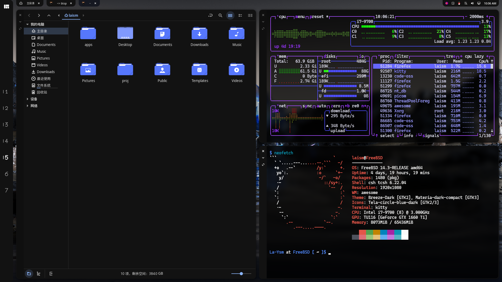

# forked from [awesome-dotfiles](https://github.com/WillPower3309/awesome-dotfiles)

## About This Configuration

This is my personal Awesome WM setup that I use on FreeBSD. It's customized for my workflow and may include some FreeBSD-specific tweaks or workarounds.

**Note:** If you're not using FreeBSD, some things might not work out of the box and you'll probably need to adjust them.

If you're looking for a more general-purpose Awesome WM configuration, consider checking out the original [awesome-dotfiles](https://github.com/WillPower3309/awesome-dotfiles) repository.

## Screenshots

## License

The upstream repository [awesome-dotfiles](https://github.com/WillPower3309/awesome-dotfiles) does not specify a license. As a fork, this configuration also does not have an explicit license. Please refer to the original repository for licensing information.
